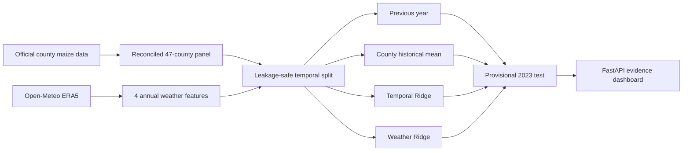

# 🌱 Shamba Signal

**An honest machine-learning study of Kenya's county-level maize yields.**

Shamba Signal asks a simple question:

> Can a small set of annual ERA5 weather features improve maize-yield prediction enough to beat transparent historical baselines?

The answer was **no—not enough**. Instead of hiding that result or searching endlessly for a better-looking model, the project publishes the no-go and makes the evidence explorable.

<p align="center">
  
</p>

## 🎯 The result

The study reconciled a private panel of **564 county-year rows** across all **47 Kenyan counties** for 2012–2023. Of those, 563 yield labels were usable.

The temporal split was fixed before evaluation:

- **2012–2021:** training
- **2022:** model selection
- **2023:** one-time final test; official labels are provisional

| Model on provisional 2023 | MAE t/ha ↓ | RMSE t/ha ↓ |
| --- | ---: | ---: |
| **County historical mean** | **0.2998** | **0.3982** |
| Weather Ridge | 0.3370 | 0.4537 |
| Temporal Ridge | 0.3615 | 0.4783 |
| Previous year | 0.4651 | 0.6057 |

Weather Ridge improved on Temporal Ridge, but remained **0.0372 t/ha behind** the county historical mean on MAE. The scientifically correct decision was therefore **no-go** for this feature set.

## 🧠 What the ML pipeline does



The weather model uses:

- annual precipitation total;
- wet-day count, where daily precipitation is greater than 1 mm;
- annual mean 2 m temperature; and
- annual maximum 2 m temperature.

Same-year production and harvested area are excluded because yield is derived from them and including them would leak the answer.

## 🖥️ What the dashboard can do

- Compare all models using **MAE or RMSE**.
- Explore annual yield history for any of the 47 counties.
- Compare the selected county's 2023 actual value with four model predictions.
- Show signed prediction errors and the closest model.
- Export county evidence as CSV or the complete evaluation fixture as JSON.
- Explain the split, features, lineage, provisional status, limitations, release, and service health.

Every analytical value comes from the generated evaluation fixture. The interface does not invent forecasts, advisories, prices, alerts, maps, or feature importance.

## ⚙️ Run locally

Requirements: **Python 3.12** and **uv 0.10.x**.

```bash
uv sync --locked --extra dev
make verify
make run
```

Open `http://127.0.0.1:8000`.

To rebuild the private weather experiment and dashboard fixture:

```bash
uv run python scripts/run_weather_experiment.py \
  --panel /path/to/modelling_panel.csv \
  --weather-cache data/raw/open-meteo-era5-batch-v1 \
  --output-root data/processed/weather-experiment-v1
```

The official source snapshots, row-level panel, cached weather responses, predictions, and generated private fixture remain outside Git while redistribution terms are unresolved.

## 🧱 Lightweight architecture

- **FastAPI** serves the application and JSON endpoints.
- **NumPy** powers the bounded modelling experiment.
- **HTML, CSS, JavaScript, and SVG** provide a responsive interactive dashboard.
- No database, React build chain, worker queue, authentication layer, or cloud deployment is required for this portfolio release.

AWS portability is documented as an architectural option only; it is not presented as implemented infrastructure.

## 🧪 Exploratory TabFM extension

A separate, optional research slice now supports a rolling temporal comparison of **TabFM Temporal** and **TabFM Weather** against the transparent baselines. It runs from an isolated PyTorch environment, writes a versioned local fixture, and appears in the dashboard without adding TabFM or model weights to the FastAPI runtime.

**No TabFM score is claimed in this repository until the private panel, cached weather data, and real pretrained checkpoint have been run.** The primary repeated evidence comes from expanding-window evaluations for 2018–2022. The 2023 fold is post-hoc and remains provisional because the project had already inspected those labels during the original bounded experiment.

```bash
make tabfm-test
make tabfm-run \
  TABFM_PANEL=/path/to/modelling_panel.csv \
  TABFM_WEATHER_CACHE=data/raw/open-meteo-era5-batch-v1
```

The default checkpoint uses a separate **non-commercial, non-production** licence. See the [TabFM temporal benchmark note](docs/modelling/tabfm-temporal-benchmark.md) for the protocol, decision rules, private artifacts, and interpretation boundary.

## ⚠️ Read the evidence correctly

This is a **retrospective county-year backtest**. It is not:

- a mid-season or live operational forecast;
- a ward-, pixel-, or farm-level yield estimate;
- a causal explanation of maize yield;
- agronomic advice or a farmer advisory system; or
- a deployed national service.

## 📚 Project notes

- [Product requirements](docs/product/PRD.md)
- [MVP definition](docs/product/MVP.md)
- [County-year modelling panel](docs/data/county-year-modelling-panel.md)
- [Temporal baseline result](docs/modelling/temporal-baseline-result.md)
- [Weather feature value test](docs/modelling/weather-feature-value-test.md)
- [TabFM temporal benchmark](docs/modelling/tabfm-temporal-benchmark.md)
- [Architecture boundary](docs/architecture/ARCHITECTURE.md)
- [Dashboard design QA](design-qa.md)

## ✅ Status

The original portfolio release remains complete. The TabFM benchmark is an isolated exploratory extension and does not change the published weather no-go.
