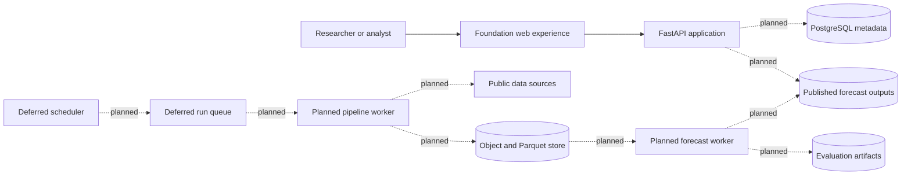

# Shamba Signal Architecture

## 1. Architectural stance and implementation status

Shamba Signal is designed as a **modular monolith with independent workers where justified**, not a premature microservice fleet.

### Implemented in the foundation

- One FastAPI process serving the public foundation page, health endpoint, static assets, OpenAPI, and the platform-status contract.
- Product, scientific, source-governance, testing, and delivery contracts.
- Candidate source catalogue and repository validation.

### Active next slice

- Source acquisition, immutable snapshots, target-data normalisation, quality reporting, and pilot confirmation.

### Planned local components

- Pipeline worker.
- Forecast/evaluation worker.
- PostgreSQL operational metadata.
- Object and Parquet storage.
- Published forecast query model.
- Minimal evidence UI after a real baseline fixture exists.

### Deferred components

- Scheduler and queue.
- Guardrailed advisory service.
- AWS deployment.
- Druid benchmark.

The architecture diagrams show logical boundaries and future deployment options. They are not evidence that those services are running.

## 2. Logical architecture

Editable companion diagram: https://www.figma.com/board/1CIbu9BqxVNXwr6pv3suY0

## 3. Module boundaries

### Data catalogue

Owns source metadata, licensing state, access method, versions, and pilot-selection evidence. It does not itself prove a source is downloadable, complete, or redistributable.

### Ingestion adapters

One bounded adapter per external source. Each adapter validates status, redirects, media type, content shape, and expected schema; rejects HTML/login/bot/error documents; preserves source bytes before transformation; uses bounded timeouts; and produces an immutable snapshot manifest.

### Quality and harmonisation

Validates schemas, units, county identity, temporal coverage, duplicates, missingness, impossible values, and source flags. It produces canonical county, crop, season, and observation records.

### Feature materialisation

Consumes canonical data and a forecast cutoff. It may not include information published after the cutoff. Every feature table records source snapshot IDs and transformation revision.

### Forecasting

Begins with mandatory naïve and tabular baselines, frozen folds, and leakage tests. A later model is retained only when held-out evidence justifies it. A documented no-go result is valid.

### Publication and UI

A future stable query model exposes supported estimates, intervals, evidence quality, cutoff, model/source lineage, and abstention. The first UI is built only after a real versioned fixture exists.

## 4. Data contracts

### Source snapshot

Where applicable, a snapshot records:

- `snapshot_id`
- `source_id`
- `publisher`
- `dataset_title`
- `landing_url`
- `acquisition_url` or request parameters
- `access_method`
- `source_version`
- `retrieved_at`
- `spatial_coverage`
- `temporal_coverage`
- `media_type`
- `byte_size`
- `content_checksum`
- `schema_fingerprint`
- `license_or_terms_snapshot`
- `license_decision`
- `redistribution_status`
- `storage_uri` using a portable logical or content-addressed identifier
- `transformation_code_revision`

Canonical manifests must not contain credentials, cookies, bearer tokens, signed URLs, or developer-machine absolute paths.

### County-season target

- stable country and county codes;
- source-provided and canonical county names;
- crop code;
- year or season and calendar source;
- original element, value, and unit;
- normalised value and unit;
- production and harvested area;
- reported yield and derived yield as separate fields;
- source and source flag;
- derivation method and conversion details;
- quality class and snapshot ID.

Derived yield requires positive area, matching county/crop/period, compatible units, explicit conversion, and a documented reconciliation tolerance. It never silently overwrites reported yield.

### Future forecast

- run, county, crop, season, and cutoff identifiers;
- point and interval values;
- baseline comparison;
- evidence-quality and abstention state;
- model, feature, source, and calendar lineage.

## 5. Storage strategy

- **Raw snapshots:** immutable, content-addressed logical paths; restricted bytes may remain external with protected references.
- **Canonical and feature datasets:** Parquet or CSV with explicit schemas and manifests.
- **Operational metadata:** PostgreSQL when operational slices justify it.
- **Model/evaluation artifacts:** object storage with checksum and code revision.

Druid is not a source of truth. It is considered only after one named query and representative-scale benchmark show an advantage over PostgreSQL/Parquet.

## 6. Testing architecture

- Parser and adapter fixture tests.
- Snapshot and canonical-schema contract tests.
- County identity, unit, range, uniqueness, missingness, and continuity tests.
- Rebuild and generated-clean-tree tests.
- Leakage tests and frozen geographic/temporal evaluation folds.
- API/OpenAPI/static/package smoke tests.
- End-to-end slice tests from fixture snapshot to published artifact.

## 7. Security and governance

Source access does not imply redistribution permission. Terms, attribution, licence decisions, checksums, and transformation lineage are retained. Secrets and local environment files never enter Git. Public output is limited to evidence that can legally be redistributed.

## 8. AWS migration path — deferred

The local interfaces intentionally map later to S3, RDS, EventBridge, SQS, Batch/ECS, Secrets Manager, and CloudWatch. The first AWS exercise reproduces one already-completed local slice with unchanged contracts, documented cost and security evidence, and a rollback/teardown procedure. Cloud deployment is not model improvement.
