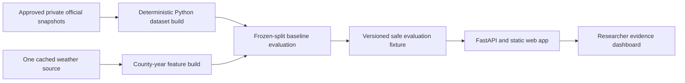

# Shamba Signal Architecture

## Current local architecture

Shamba Signal is a small Python application, not a distributed platform.

- `src/shamba_signal/datasets/` reads and reconciles the approved source formats.
- `src/shamba_signal/modelling/` owns leakage-safe model and metric calculations.
- `scripts/` provides reproducible build/evaluation entry points.
- Generated raw, row-level, and restricted artifacts remain outside Git.
- FastAPI serves the local API and static dashboard from the generated safe fixture.

No database, queue, scheduler, worker fleet, feature store, model registry, or observability stack is
needed to complete the product.

## Evidence boundary

The labels are annual county aggregates. The architecture therefore supports a county-year
retrospective backtest and evidence explorer—not mid-season operations, farm predictions, causal
analysis, or advice. The product must expose provisional/no-go states instead of manufacturing a
forecast claim.

## Optional AWS portability mapping

If the proven local workflow ever needs remote execution, its boundaries map simply:

| Local responsibility | Possible AWS service |
| --- | --- |
| Private snapshot/artifact storage | S3 |
| Bounded Python build/evaluation job | AWS Batch or ECS task |
| Small web application | App Runner or ECS Fargate |
| Static assets/screenshots | S3 plus CloudFront |
| Job logs | CloudWatch Logs |

This is an architecture note, not an implementation backlog. Do not deploy these services for the
portfolio release.
