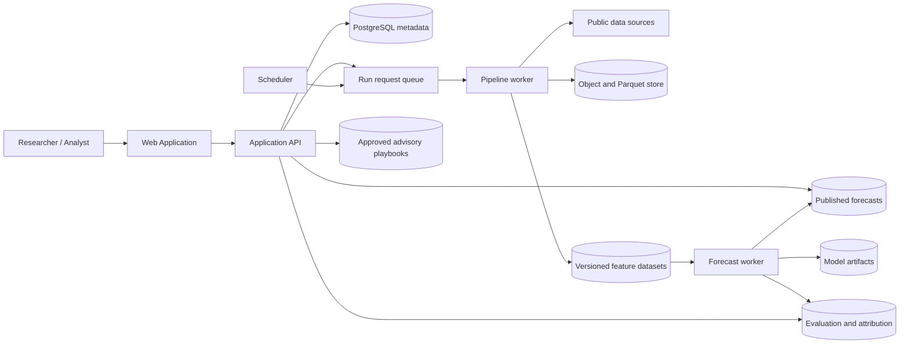
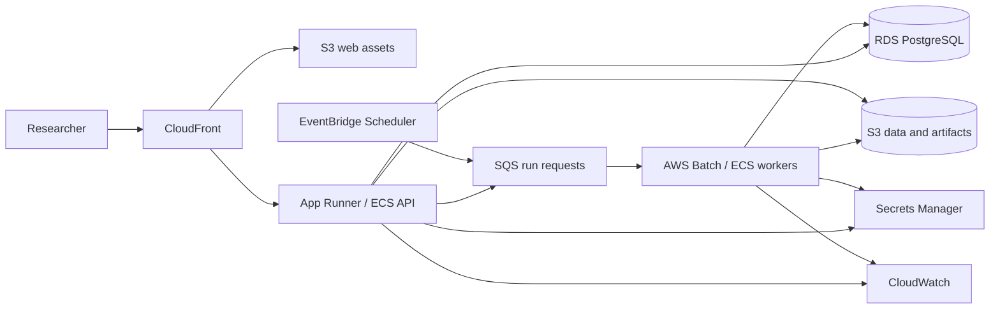

# Shamba Signal Architecture

## 1. Architectural stance

Shamba Signal begins as a **modular monolith with independent workers**, not a microservice fleet.
The boundaries are explicit enough to split later, while local execution remains understandable and cheap.
The platform has four deployable responsibilities:

1. **Web client** — national outlook, county analysis, model evidence, data explorer, advisory review.
2. **Application API** — query contracts, run requests, exports, authentication boundary, and metadata.
3. **Pipeline worker** — source ingestion, validation, harmonisation, feature materialisation, and lineage.
4. **Forecast worker** — training, backtesting, inference, interval calibration, attribution, and publication.

The foundation release combines the web client and API in one FastAPI process while preserving package
boundaries. The first split should occur only when scheduled jobs or scaling requirements justify it.

## 2. Working architecture

Editable companion diagram: https://www.figma.com/board/1CIbu9BqxVNXwr6pv3suY0

## 3. Module boundaries

### Data catalogue

Owns source metadata, licensing state, access method, dataset versions, and pilot-selection criteria.
It does not download data by itself.

### Ingestion adapters

One adapter per external source. Each adapter produces an immutable raw snapshot plus a manifest.
Adapters never perform model-specific feature engineering.

### Quality and harmonisation

Validates schemas, units, temporal coverage, geometry, missingness, duplicates, and source flags.
It produces canonical county, crop, season, and observation contracts.

### Feature materialisation

Consumes canonical data and a forecast cutoff. It produces feature tables that cannot include information
published after the cutoff. Every feature table records its source snapshot IDs and transformation version.

### Forecasting

Trains baselines and candidate models, performs spatial and temporal validation, calibrates intervals,
and writes immutable model/evaluation artifacts.

### Forecast publication

Converts model output into a stable query model: county estimate, interval, anomaly, flag, confidence,
data quality, run ID, cutoff, calendar source, model version, and attribution references.

### Advisory

Consumes published forecast evidence and versioned playbooks. It returns only allowed actions and
suppresses output when confidence, stage, or evidence rules are not satisfied.

## 4. Data contracts

### Source snapshot

- `source_id`
- `retrieved_at`
- `source_version`
- `request_parameters`
- `content_checksum`
- `license_snapshot`
- `storage_uri`

### County-season target

- `country_code`
- `county_code`
- `crop_code`
- `season_id`
- `calendar_source`
- `harvested_area_ha`
- `production_tonnes`
- `yield_t_ha`
- `yield_derivation`
- `source_flag`
- `quality_class`

### Forecast

- `forecast_id`
- `run_id`
- `county_code`
- `crop_code`
- `season_id`
- `cutoff_date`
- `point_t_ha`
- `lower_t_ha`
- `upper_t_ha`
- `historical_anomaly_pct`
- `risk_flag`
- `confidence_class`
- `data_quality_class`
- `model_version`
- `feature_snapshot_id`
- `calendar_source`

## 5. Storage strategy

- **Raw snapshots:** immutable object storage paths partitioned by source and retrieval date.
- **Canonical and feature datasets:** Parquet with explicit schemas and partition manifests.
- **Operational metadata:** PostgreSQL for sources, runs, model registry metadata, forecasts, and playbooks.
- **Model artifacts:** object storage with checksum, code revision, training configuration, and evaluation link.
- **Published query tables:** PostgreSQL materialisations optimised for maps and comparisons.

Apache Druid is not the source of truth. A later proof slice loads forecast and stress time-series into
Druid only where slice acceptance tests demonstrate a useful analytical query or latency advantage.

## 6. Execution modes

### Scheduled national refresh

The scheduler submits a run with crop, season, cutoff, and source policy. The pipeline creates or reuses
source snapshots, validates evidence, materialises cutoff-safe features, runs inference, publishes a new
version, and retains the previously published version if any stage fails.

### Analyst-triggered run

An analyst chooses a historical season, cutoff, county set, and model configuration. The system writes a
separate research run that cannot overwrite the current national publication without explicit promotion.

## 7. Error handling

- Source failures are isolated by adapter and recorded in the run manifest.
- Schema drift fails ingestion before canonical tables are updated.
- Missing evidence reduces data-quality class and can force abstention.
- Model failure leaves the prior published forecast active.
- Advisory failure never blocks forecast publication; it is a derived, separately versioned output.
- Every error carries `run_id`, stage, source/model identifier, and a human-readable remediation hint.

## 8. Testing architecture

- Unit tests for parsing, unit conversion, calendar rules, feature windows, risk rules, and playbook gates.
- Contract tests for external adapter fixtures and canonical schemas.
- Data-quality tests for ranges, uniqueness, temporal order, geometry, and missingness.
- Leakage tests proving post-cutoff observations cannot enter features.
- Spatial and temporal validation tests for modelling workflows.
- API tests for stable response schemas and publication selection.
- End-to-end slice tests from fixture snapshot to displayed forecast.

## 9. Security and governance

Public data does not remove governance obligations. Source terms, redistribution rights, attribution,
checksums, and transformation lineage are retained. Secrets never enter notebooks or Git. Production
roles separate read-only public access, analyst run submission, playbook approval, and publication promotion.

## 10. AWS migration path

The local interfaces intentionally map to AWS after core product slices work:

| Working component | AWS target | Reason |
|---|---|---|
| Local/static web assets | S3 + CloudFront or Amplify | public delivery and caching |
| FastAPI container | App Runner or ECS Fargate | managed container runtime |
| PostgreSQL | Amazon RDS for PostgreSQL | operational metadata and query model |
| Object/Parquet store | Amazon S3 | raw, canonical, features, models, exports |
| Scheduled runs | EventBridge Scheduler | national refresh trigger |
| Pipeline/forecast jobs | AWS Batch or ECS tasks | isolated, retryable compute |
| Run request queue | Amazon SQS | decoupled job submission |
| Secrets | AWS Secrets Manager | managed rotation and access control |
| Logs and metrics | CloudWatch | run-level operations and alarms |
| Model metadata | PostgreSQL + S3 initially | avoid premature SageMaker dependency |
| Optional mature registry | SageMaker Model Registry | approval workflow when justified |

### Migration rule

AWS migration is accepted only after a completed product slice can be run locally, then reproduced on AWS
with the same contracts, tests, run manifest, and forecast outputs within documented numerical tolerance.
